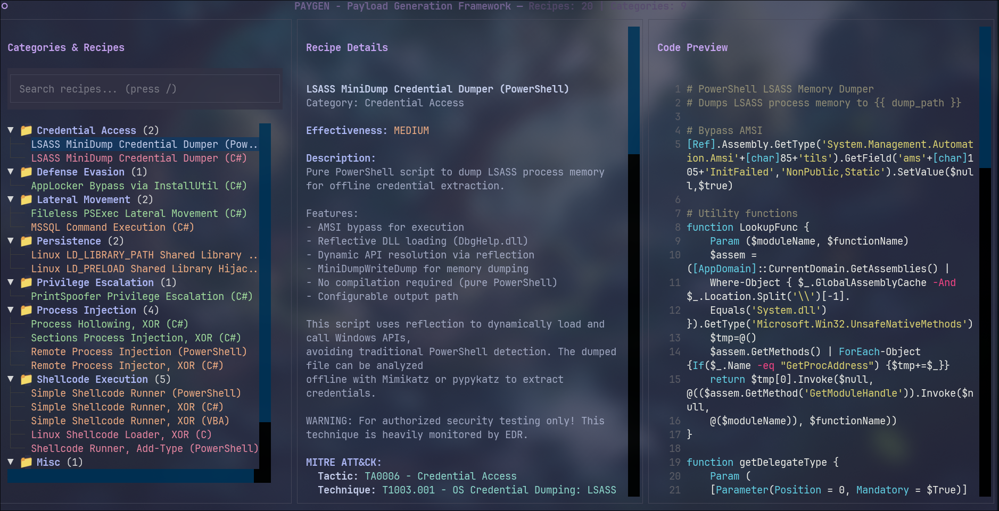

# Paygen

> Modern TUI & Web framework for offensive payload generation


Paygen is a dual-interface payload generation framework for security researchers and penetration testers. It provides both a beautiful terminal UI (TUI) and a modern web interface for creating and customizing offensive payloads with built-in MITRE ATT&CK mappings, effectiveness ratings, and advanced preprocessing pipelines.

---

## Screenshots

### Terminal UI (TUI)


### Web Interface


---

## Features

- 🎨 **Dual Interface** - Choose between TUI (terminal) or Web GUI
- 🌐 **Web GUI** - Modern web interface with real-time validation and syntax highlighting
- 🖥️ **Beautiful TUI** - Catppuccin Mocha theme with vim-style navigation
- 📋 **Recipe System** - YAML-based payload definitions with rich metadata
- 🔄 **Preprocessing** - Chain XOR/AES encryption, compression, encoding
- 🎯 **MITRE ATT&CK** - Built-in tactic and technique mappings
- 📊 **Effectiveness** - HIGH/MEDIUM/LOW evasion ratings
- 📜 **History** - Track all builds with parameters and launch instructions
- ⚡ **Flexible** - Template-based (C#, PS1) and command-based (msfvenom)
- 🔍 **Search** - Quickly find recipes with built-in search functionality
- ✅ **Validation** - Real-time parameter validation (IP, port, paths, hex)
- 🎛️ **Build Options** - Remove comments, console output, strip binaries

---

## Installation

```bash
# Clone repository
git clone https://github.com/Hailst0rm1/paygen.git
cd paygen

# Install dependencies
pip install -r requirements.txt

# Run TUI
python -m src.main

# Or run Web GUI
python -m src.web_main
# Then open http://localhost:1337 in your browser
```

### Requirements

- Python 3.10+
- Optional: `msfvenom`, `mcs` (Mono), `gcc`/`mingw-w64`

---

## Quick Start

### Terminal UI (TUI)

```bash
# 1. Launch TUI
python -m src.main

# 2. Navigate with j/k or arrow keys
# 3. Press Ctrl+G on any recipe to generate
# 4. Fill parameters (required fields marked with *)
# 5. View history with Ctrl+H
```

### Web GUI

```bash
# 1. Launch web server
python -m src.web_main

# 2. Open browser to http://localhost:1337

# 3. Click any recipe to view details
# 4. Click "Generate" to configure parameters
# 5. Use "/" to search recipes
# 6. Click "History" to view past builds
```

---

## Navigation

### Terminal UI (TUI)

| Key              | Action           |
| ---------------- | ---------------- |
| `j`/`k`, `↑`/`↓` | Navigate         |
| `h`/`l`, `Tab`   | Switch panels    |
| `Ctrl+G`         | Generate payload |
| `Ctrl+H`         | Build history    |
| `Ctrl+F`         | Fullscreen code  |
| `?`              | Help             |
| `Ctrl+Q`         | Quit             |

### Web GUI

| Action              | Method                        |
| ------------------- | ----------------------------- |
| Search recipes      | Press `/` or click search box |
| Select recipe       | Click recipe name             |
| Generate payload    | Click "Generate" button       |
| View history        | Click "History" button        |
| View recipe details | Click history entry           |
| Refresh recipes     | Click refresh icon (top-left) |
| Copy code           | Click copy icon in code panel |

---

## Recipe Format

Recipes are YAML files with 4 sections:

```yaml
meta:
  name: "Recipe Name"
  category: "Process Injection"
  description: "What this payload does"
  effectiveness: high # low, medium, high
  mitre:
    tactic: "TA0005 - Defense Evasion"
    technique: "T1055 - Process Injection"
  artifacts:
    - "Observable behavior 1"
    - "Observable behavior 2"

parameters:
  - name: "lhost"
    type: "ip"
    description: "Attacker IP"
    required: true
  - name: "lport"
    type: "port"
    default: 4444
    required: true

preprocessing:
  - type: "command"
    name: "generate_shellcode"
    command: "msfvenom -p windows/x64/... LHOST={{ lhost }} -f raw"
    output_var: "shellcode"
  - type: "script"
    name: "encrypt"
    script: "aes_encrypt.py"
    args:
      data: "{{ shellcode }}"
    output_var: "encrypted"

output:
  type: "template" # or "command"
  template: "injector.cs"
  compile:
    enabled: true
    command: "mcs -out:{{ output_path }}/{{ output_file }} {{ source_file }}"
  launch_instructions: |
    # Start listener
    msfconsole -x "use exploit/multi/handler; ..."
```

---

## Built-in Preprocessors

Located in `preprocessors/`:

- `xor_encrypt.py` - XOR encryption with auto-key generation
- `aes_encrypt.py` - AES-256-CBC encryption
- `base64_encode.py` - Base64 encoding
- `compress.py` - Gzip compression
- `format_csharp.py` - Format bytes as C# arrays
- `caesar_cipher.py` - Caesar cipher

---

## Directory Structure

```
paygen/
├── src/
│   ├── core/           # Config, recipes, validation, building
│   ├── tui/            # TUI panels and widgets
│   ├── web/            # Web GUI (Flask + static assets)
│   │   ├── app.py      # Flask application & REST API
│   │   ├── static/     # CSS, JavaScript
│   │   └── templates/  # HTML templates
│   ├── main.py         # TUI entry point
│   ├── web_main.py     # Web GUI entry point
│   └── utils/          # Utilities
├── recipes/            # Recipe YAML files (tracked in git)
├── templates/          # Source templates (tracked in git)
├── preprocessors/      # Processing scripts (tracked in git)
├── output/             # Generated payloads (gitignored)
├── tests/              # Test suite (37 tests)
├── screenshots/        # UI screenshots
└── docs/               # Documentation
```

---

## Configuration

Located at `~/.config/paygen/config.yaml`:

```yaml
# Directories
recipes_dir: "~/Documents/Tools/paygen/recipes"
templates_dir: "~/Documents/Tools/paygen/templates"
preprocessors_dir: "~/Documents/Tools/paygen/preprocessors"
output_dir: "~/Documents/Tools/paygen/output"

# Build options
keep_source_files: false
show_build_debug: false
remove_comments: true # Strip comments from source before compilation
strip_binaries: true # Remove debug symbols from compiled binaries

# Web GUI settings
web_host: "0.0.0.0" # Bind to all interfaces
web_port: 1337 # Web server port
web_debug: false # Flask debug mode
```

### Web GUI Features

The web interface provides:

- **Real-time Validation**: Parameters validated as you type (IP addresses, ports, paths, hex values)
- **Syntax Highlighting**: Code preview with language-specific highlighting (C#, PowerShell, Python, etc.)
- **Search**: Press `/` to quickly find recipes by name or category
- **Build Progress**: Real-time build status with step-by-step progress
- **Build Options**: Checkboxes to remove comments, console output, or strip binaries
- **History Management**: View all builds, detailed parameters, and delete individual entries
- **Launch Instructions**: Formatted markdown with syntax-highlighted code blocks and copy buttons
- **Responsive Design**: Clean 3-panel layout with Catppuccin Mocha theme

---

## Example Recipes

### 1. Basic Msfvenom Payload

Simple msfvenom reverse TCP shell:

```bash
# Select: "Basic Msfvenom Reverse TCP Shell"
# Parameters: lhost=192.168.1.100, lport=4444
# Output: payload.exe
```

### 2. AES-Encrypted C# Injector

Process injection with AES-256-CBC encryption:

```bash
# Select: "C# AES-Encrypted Shellcode Injector"
# Parameters: target_process=explorer.exe, lhost, lport
# Steps: msfvenom → AES encrypt → C# template → compile
# Output: injector.exe
```

### 3. XOR-Encoded Injector

Simple XOR obfuscation:

```bash
# Select: "XOR-Encoded Shellcode Injector"
# Parameters: lhost, lport, xor_key=fa
# Steps: msfvenom → XOR encode → C# template → compile
# Output: xor_injector.exe
```

---

## Testing

```bash
# Run all tests
pytest

# Run specific test file
pytest tests/test_recipes.py -v

# Run with coverage
pytest --cov=src tests/
```

Current test coverage: 37 tests passing

---

## Creating Custom Recipes

### Template-Based Recipe

1. Create template in `templates/`:

```csharp
// templates/my_payload/injector.cs
using System;

class MyPayload {
    static byte[] encrypted = { {{ encrypted_shellcode }} };
    static byte[] key = { {{ aes_key }} };

    static void Main() {
        // Your payload logic
    }
}
```

2. Create recipe in `recipes/`:

```yaml
meta:
  name: "My Custom Payload"
  category: "Custom"
  effectiveness: high

parameters:
  - name: "lhost"
    type: "ip"
    required: true

preprocessing:
  - type: "command"
    name: "gen_shellcode"
    command: "msfvenom -p windows/x64/... LHOST={{ lhost }} -f raw"
    output_var: "shellcode"

  - type: "script"
    name: "encrypt"
    script: "aes_encrypt.py"
    args:
      data: "{{ shellcode }}"
    output_var: "encrypted"

output:
  type: "template"
  template: "my_payload/injector.cs"
  compile:
    enabled: true
    command: "mcs -out:{{ output_path }}/{{ output_file }} {{ source_file }}"
```

### Custom Preprocessor

Create in `preprocessors/`:

```python
#!/usr/bin/env python3
import sys
import json
import base64

def main():
    args = json.load(sys.stdin)
    data = base64.b64decode(args['data'])

    # Your processing logic
    result = process(data)

    output = {
        'processed': base64.b64encode(result).decode(),
        'size': len(result)
    }
    print(json.dumps(output))

def process(data):
    # Custom processing
    return data

if __name__ == "__main__":
    main()
```

---

## Security & Ethics

⚠️ **Important**: This tool generates malicious payloads for authorized security testing ONLY.

**Authorized Use:**

- ✅ Penetration testing with written authorization
- ✅ Red team operations
- ✅ Security research in controlled environments
- ✅ Educational purposes

**Never Use For:**

- ❌ Unauthorized access
- ❌ Malicious activity
- ❌ Illegal operations

**OpSec:**

- `output/` directory is gitignored (NEVER commit payloads)
- `config.yaml` contains local paths (gitignored)
- `history.json` contains sensitive build data (gitignored)

---

## Troubleshooting

### "Compiler not found"

```bash
# Install Mono (C# compiler)
sudo apt install mono-mcs  # Debian/Ubuntu
sudo pacman -S mono        # Arch

# Install msfvenom
sudo apt install metasploit-framework
```

### "Permission denied" on payload

```bash
chmod +x output/payload.exe
```

### Template variables not rendering

Ensure preprocessing `output_var` matches template placeholder:

```yaml
# Recipe
output_var: "encrypted_data"

# Template
{{ encrypted_data }}
```

---

## Development

### Running Tests

```bash
pytest tests/ -v
```

### Project Structure

- `src/core/` - Core functionality (config, recipes, validation, building)
- `src/tui/` - Textual TUI components
- `src/utils/` - Utility functions
- `tests/` - Test suite

### Tech Stack

- **TUI**: Textual 0.47.0
- **Web**: Flask 3.0.0+, Flask-CORS
- **Frontend**: Vanilla JavaScript, Prism.js (syntax highlighting), Marked.js (markdown)
- **Templates**: Jinja2
- **Crypto**: PyCryptodome
- **Testing**: pytest
- **Theme**: Catppuccin Mocha

---

## Roadmap

- [ ] Docker containerization
- [ ] Additional payload templates (Go, Rust, Python)
- [ ] C2 framework integration
- [ ] Automated obfuscation
- [ ] OPSEC scoring system

---

## License

MIT License - See [LICENSE](LICENSE) file for details.

Free and open source for security research and educational purposes.

---

## Acknowledgments

- [Textual](https://textual.textualize.io/) - Modern TUI framework
- [Catppuccin](https://github.com/catppuccin) - Beautiful color palette
- [Metasploit](https://www.metasploit.com/) - Shellcode generation

---

**Remember**: With great power comes great responsibility. Use ethically. 🛡️

**Author**: Hailst0rm  
**Repository**: https://github.com/Hailst0rm1/paygen
